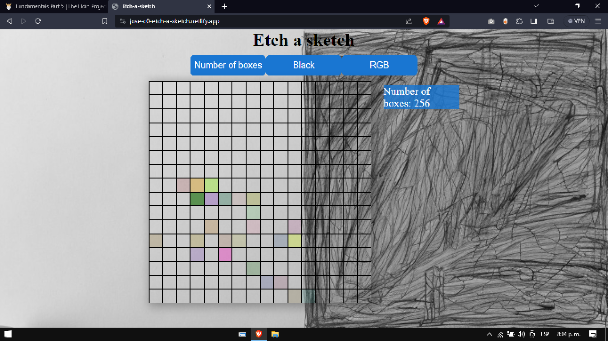

# About Project

The project consists of creating a web page with a grid of 16 x 16 square divs.

Inspired by The Odin Project for the construction of the project I used:

- HTML5 for the structure.
- Use of CSS3 grid and flex to align elements.
- Github to display the page.
- Maintain clean code practices

### Preview

### Live:

https://jose-c0.github.io/TheOdinProject/Etch-a-Sketch/index.html

## Features

The divs are created using JavaScript.

- A hover effect was set up so that the divs in the grid change color when the mouse hovers over them, leaving a trail (pixelated) across their grid like a pen would.

- At the top of the screen is a button that will send the user a pop-up window asking for the number of squares per side for the new grid. Once entered, the existing grid will be deleted and a new grid will be generated in the same total space as before.

- Instead of a simple color change from black to white, each interaction completely randomizes the RGB value of the square. In addition, it implements a progressive darkening effect where each interaction adds 10% more black or color to the square.
