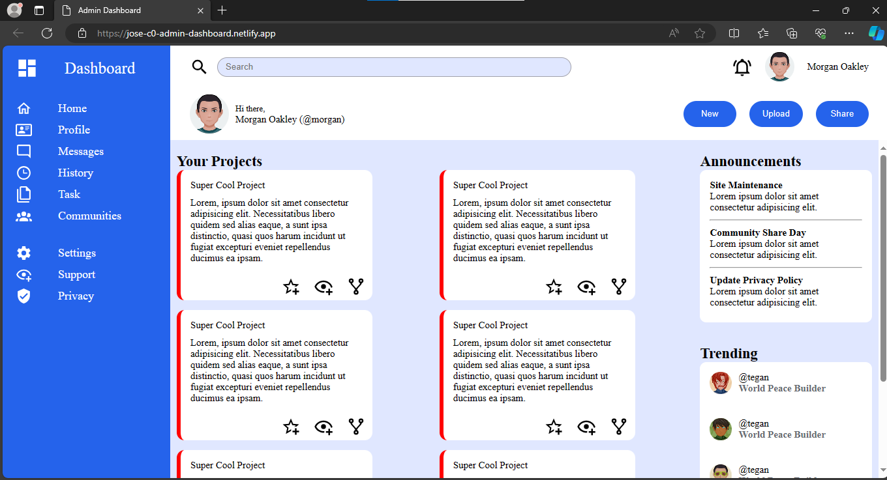

# About Project

Implementation of a admin dashboard

Inspired by The Odin Project for the construction of the project I used:

- HTML5 for the structure.
- JavaScript.
- Use of CSS3 grid and flex to align elements.
- Github to deploy the page.
- Maintain clean code practices

### Preview

### Live:
https://jose-c0.github.io/TheOdinProject/admin-dashboard/index.html