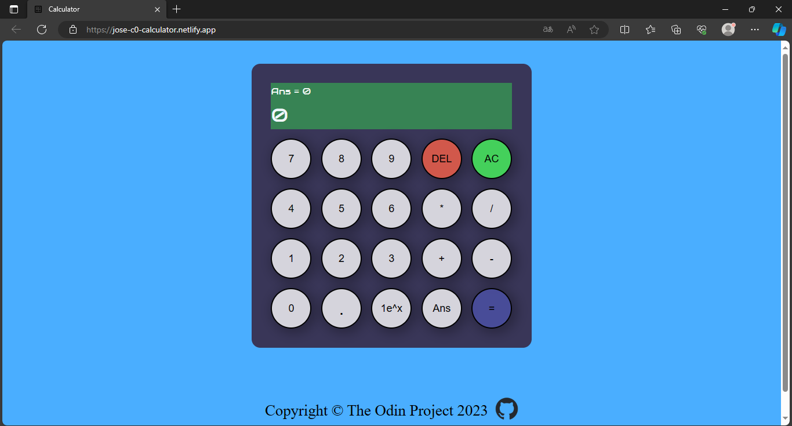

# About Project

[](https://choosealicense.com/licenses/unlicense/)

This project is a calculator using HTML, CSS and JavaScript that contains functions for all basic mathematical operators (multiplication, division, addition and subtraction). Users can interact with it via mouse or keyboard.

Inspired by The Odin Project for the construction of the project I used:

- HTML5 for the structure.
- Keyboard support
- Use of CSS3 grid and flex to align elements.
- Metlify to display the page.
- Maintain clean code practices

### Preview


### Live:
https://jose-c0-calculator.netlify.app/


## Features
### Javascript
                
- The function **convertStringToNumbers(str)**. It receives a string as a parameter, stores the values in an array, converts the strings to numbers, keeps the operators as strings and the values that are expressed in scientific notation are converted to numbers.

First I loop through each element of the string. I use the variable `num` to store each string value, if the string element is an operator belonging to `listValuesOperators`. I store in the array `newStr` the value that is in `num` and say that num is an empty string (num = "") to store the next element, then I store the operator in the array newStr. 

After fulfilling the above conditions I move on to the next element of the string.
```javascript
  for (let index = 0; index < str.length; index++) {
    if (listValuesOperators.includes(str[index])) {
      if (num.includes("e^x")) newArray.push(num);
      else newArray.push(Number(num));

      newArray.push(str[index]);
      num = "";
      continue;
    }
```

Si el elemento actual del for (str[index]) contine la expresión “e^x” hago un push en newStr de lo que tengo almacenado en num.
```javascript
      if (num.includes("e^x")) newArray.push(num);
      else newArray.push(Number(num));
```

Como los números y “e^x” no pertenecen en listValuesOperators, num contiene números a la izquierda y derecha de la expresión “e^x” y de esa manera se almacena el coeficiente y exponente de la expresión de la notación científica. Example = num = "1e^x2".

Al encontrar un operador "1e^x2" es almacenado en newStr. 

```javascript
    if (listValuesOperators.includes(str[index])) {
      if (num.includes("e^x")) newArray.push(num);
      else newArray.push(Number(num));

      newArray.push(str[index]);
      num = "";
```
Finally I use a for of in newStr to convert the expression in scientific notation to a number. Example: 1e^x2 = 100

```javascript
  for (const iterator of newArray) {
    if (
      typeof iterator === "string" &&
      !listValuesOperators.includes(iterator)
    ) {
      let stringSplit = iterator.split("");
      let posAfterX = stringSplit.indexOf("x") + 1;
      let posBeforeE = stringSplit.indexOf("e") - 1;
      let exponent = Number(
        stringSplit.slice(posAfterX, stringSplit.length).join("")
      );
      let coefficient = Number(stringSplit.slice(0, posBeforeE + 1).join(""));

      for (let index = 0; index < exponent; index++) {
        coefficient += "0";
      }
      otherStr.push(Number(coefficient));
      continue;
    }
    otherStr.push(iterator);
  }
```


```javascript
String original - [“1”, “0”, "+", “5”, “0”, "+", "1”, “e^x”, “2"]
newStr - [10, "+", 50, "+", "1e^x2"]
otherStr - [10, "+", 50, "+", 100]  // This is what the function returns.
```


- The function **operation(positionOp, operand, string)**: Takes an operator (+, -, *, /) and 2 numbers and then returns the result of the operation.

```javascript
function operation(positionOp, operand, string) {
  let result = 0;

  n1 = string[positionOp - 1];
  n2 = string[positionOp + 1];

  if (operand === "*") result = Multiply(n1, n2);
  if (operand === "/") result = Divide(n1, n2);
  if (operand === "+") result = Add(n1, n2);
  if (operand === "-") result = Subtract(n1, n2);

  return result;
}
```

- The function **finalScore(string)**: takes as parameter the result of the function convertStringToNumber. Example: finalScore([10, "+", 50, "+", 100])

This function determines the priority of the operations:
                
1. multiplying.
2. Division.
3. Addition.
4. Subtraction.

```javascript
function finalScore(string) {
  let r = 0;
  let posMultiply = string.indexOf("*");
  let posDivide = string.indexOf("/");
  let posAdd = string.indexOf("+");
  let posSubtract = string.indexOf("-");

  for (let index = 0; index < string.length + 1; index++) {
    posMultiply = string.indexOf("*");
    posDivide = string.indexOf("/");
    posAdd = string.indexOf("+");
    posSubtract = string.indexOf("-");

    if (posMultiply != -1) {
      r = operation(posMultiply, "*", string);
      string.splice(posMultiply - 1, 3, r);
      continue;
    }

    if (posDivide != -1) {
      r = operation(posDivide, "/", string);
      string.splice(posDivide - 1, 3, r);

      if (r === "💀 there was an error!") {
        return r;
      }
      continue;
    }

    if (posAdd != -1) {
      r = operation(posAdd, "+", string);
      string.splice(posAdd - 1, 3, r);
      continue;
    }
    if (posSubtract != -1) {
      r = operation(posSubtract, "-", string);
      string.splice(posSubtract - 1, 3, r);
      continue;
    }
  }

  return r;
}
```
## HTML code

Here is a brief explanation of the purpose of the HTML:

`Div Container (container-calculator)`: This container groups all the elements of the calculator. It can be useful to apply styles or manipulations to the complete set of the calculator.

`Div Calculator (calculator)`: This div contains all the elements of the calculator, such as the display screen and buttons. It is the main working area of the calculator.

`Div Display (display)`: This div contains the two displays of the calculator: one to show the current result (result-display) and one to show the previous answer (ans-display).

**Numeric buttons (num-one, num-two, ..., num-nine, num-zero)**: These buttons represent numeric digits from 0 to 9. They allow the user to enter numbers to perform calculations.

**Operator buttons (op-multiply, op-divide, op-add, op-subtract)**: These buttons represent basic mathematical operators: multiplication, division, addition and subtraction. They allow the user to select the operation to be performed.

`dot button (dot)`: This button represents the decimal point, allowing the entry of decimal numbers.

`Scientific Notation button (scientificNotation)`:
This button represents the scientific notation ("e^x"), which can be used to enter numbers in scientific format.
