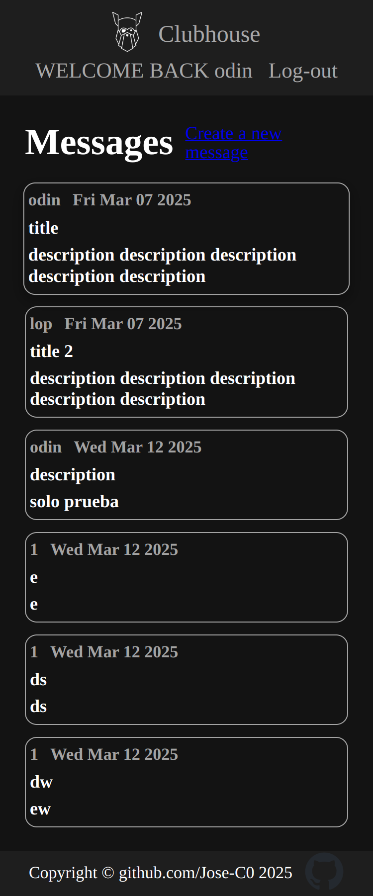
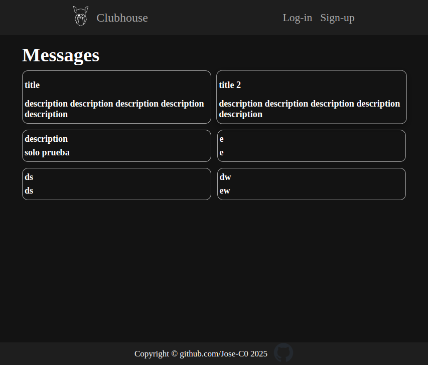

# Members Only

This project is be a web application that includes basic functionalities such as registration, login, logout, creating messages and adding members. The application is structured following the MVC (Model-View-Controller).

Live in render: https://members-only-wu4a.onrender.com/

This project consists in:

- Setting up a db in PostgreSQL.
- Setting up and querying with node-postgres.
- Setting up with docker compose nodeJs and server postgres.
- Supabase to handle database operations.
- Deploy on render.

## Tools

- Docker Compose
- node.js
- Express.js
- Template engine: EJS
- Passport.js ([Strategy Username & Password](https://www.passportjs.org/howtos/password/) )
- express-validator
- PostgreSQL
- HTML, CSS, JavaScript
- Semistandard

## Screenshots





## Requirements

1. [Install Docker Compose. ](https://docs.docker.com/compose/install/)
2. Install [node.js ](https://nodejs.org/en/download)
3. Install dependendencies. (npm install).
4. [Set up environment Variables. ](#environment-variables)

Finally [Run project using Docker Compose ](#run-project-using-docker-compose)

## Environment Variables

To run this project, you will need to add the following environment variables to your .env file. Not necessarily the value of all variables must be equal.

> HOSTS_DB="postgres_server_test_odin"  
> PORT_DB="5432"  
> USER_DB="odin"  
> PASSWORD_DB="paassword"  
> DATABASE_DB="odindb"  
> IP_NODE_SERVER="localhost"  
> PORT_NODE_SERVER="3000"  
> PORT_NODE_SERVER_DOCKER="3000"

## Run project using Docker Compose

Execute the following commands in the path where compose.yml is located

```bash
docker compose up --watch  # Create and start containers.
docker compose stop  # Stop services
```

To see more information about [docker commands.](./README.Docker.md)

## Dockerfile on folder scirpts/

This is what the Dockerfile in the scripts/ folder does:

1. Copy the scripts to the postgres server.
2. dbIsEmpty.sh - Check if the database has created tables.

```bash
psql -h localhost -p 5432  -U odin -d inventorydb -c '\dt' 2> /scrips/error.txt
```

3. The DB is created IN CASE THE DB DOESN'T EXIST

```bash
psql -h localhost -p 5432  -U odin -d inventorydb -f $sqlScript
```

–h # is host name  
-p # is port number  
-d # is database name  
-U # is for user name  
-f # path to script sql

## Semistandard

[](https://github.com/standard/semistandard)

Semistandard is the JavaScript Standard Style on this project

```bash
npm run formatter # Fix most issues automatically of formatter

semistandard --fix "src/controllers/*.mjs" # You can optionally pass in a directory (or directories) using the glob pattern.

```
