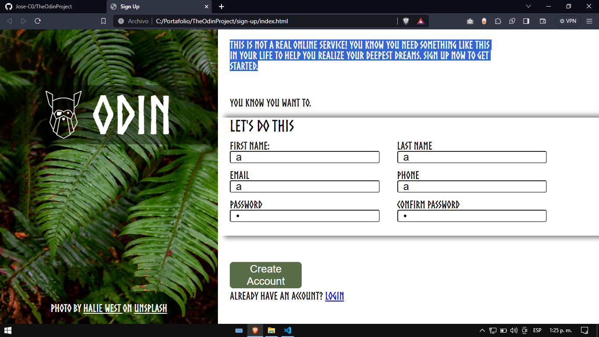

# About Project

Implementation of a form for a signup page, the form is used to validate data.

Inspired by The Odin Project for the construction of the project I used:

- HTML5 for the structure.
- JavaScript.
- Use of CSS3 grid and flex to align elements.
- Metlify to deploy the page.
- Maintain clean code practices

### Preview

### Live:
https://jose-c0-sign-up.netlify.app/
