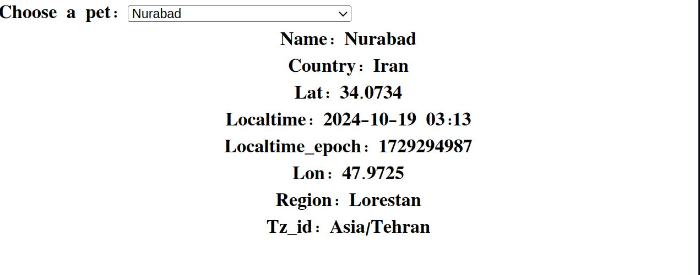

# About Project

Este código implementa una funcionalidad para obtener y mostrar información meteorológica de una ciudad seleccionada utilizando la API de WeatherAPI y un archivo local de lista de ciudades (current.city.list.json). A continuación se explica en detalle:

Inspired by The Odin Project for the construction of the project I used:

- HTML5 for the structure.
- JavaScript.
- Async/Await 
- Maintain clean code practices

### Preview

### Live:

https://jose-c0.github.io/weather-app/sign-up/index.html
